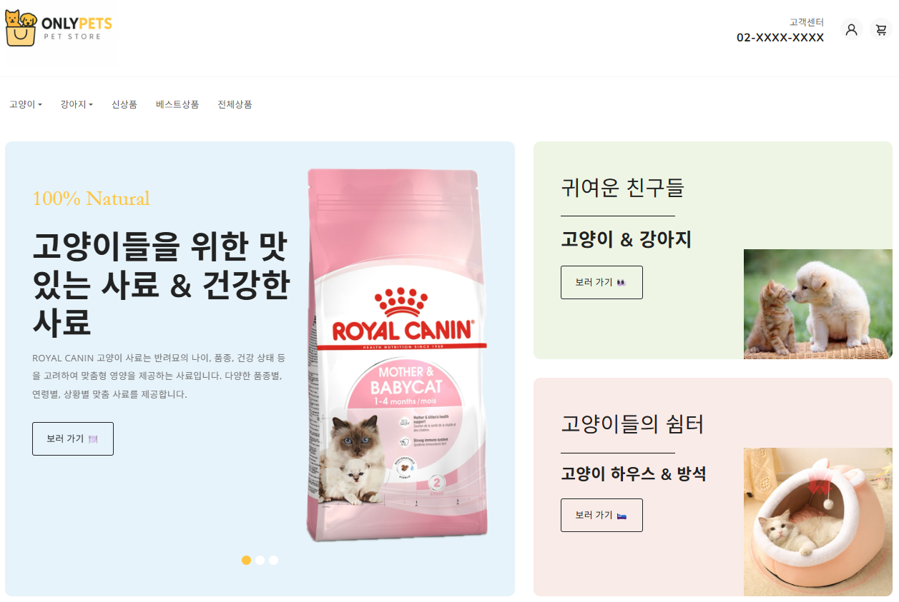
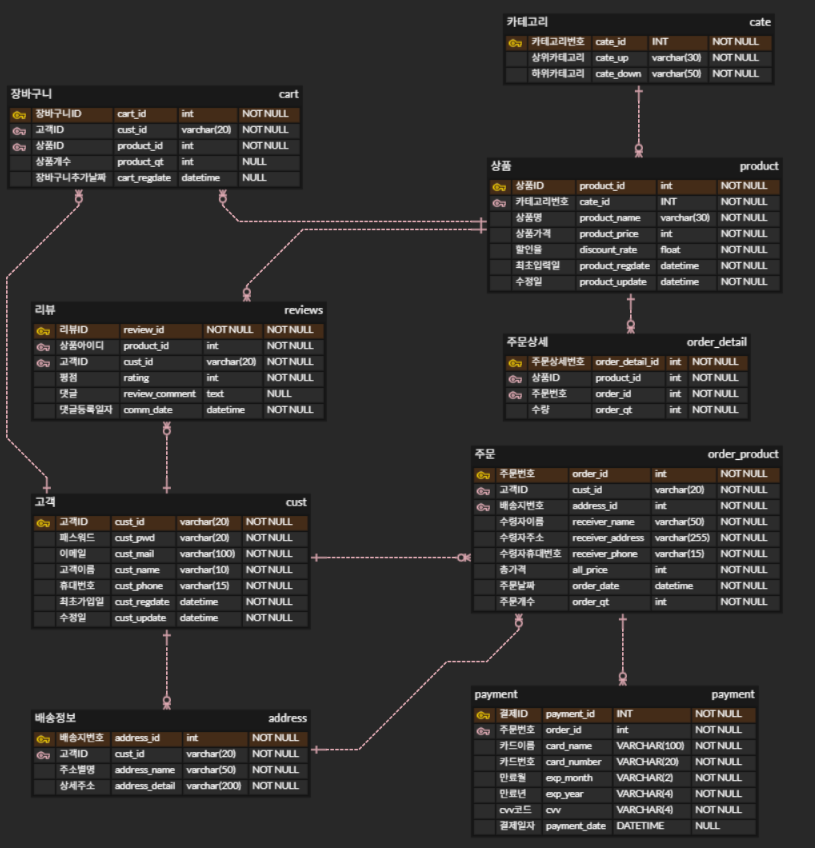

# 🐾 PetShop 쇼핑몰 프로젝트

**Spring Boot + MyBatis + JSP 기반의 반려동물 쇼핑몰 웹 프로젝트**  
회원가입부터 상품 구매, 결제까지 전 과정을 구현한 전자상거래 플랫폼

## 📌 프로젝트 개요

- 반려동물 용품을 판매하는 쇼핑몰 웹사이트
- 회원은 상품을 둘러보고, 장바구니 기능을 사용하여 상품을 구매 가능
- 리뷰를 통해 댓글 작성 및 평점 등록 가능
- 관리자는 상품 & 리뷰 등록/수정/삭제 및 주문 내역 관리 가능
- Spring MVC 구조 기반의 서버 연동 + JSP 뷰 템플릿 사용

***
## 🧑‍💻팀원 및 역할
|이름| Git 주소                        |
|:----|:------------------------------|
|구민우| https://github.com/rnalsdn100 |
|정승혁| https://github.com/5397jsh |
|김우성| https://github.com/KING-WS   |
***

## 🧱 기술 스택

| 영역 | 기술 |
|------|------|
| Language | Java 17 |
| Web Framework | Spring Boot, Spring MVC |
| View | JSP, JSTL, CSS, JS, Bootstrap |
| ORM | MyBatis |
| DB | MySQL |
| Build Tool | Gradle |
| Server | Tomcat |
| Tool | IntelliJ IDEA, GitHub |

---

## 🧾 ERD 다이어그램

## 🗂 주요 기능

### 👤 회원 기능
- 회원가입, 로그인, 로그아웃
- 회원정보 조회 및 수정
- 주문 시 결제 수단 자동 입력
- 배송지 추가 및 선택 가능

### 🛍 상품 기능
- 상품 카테고리별 조회 (고양이/강아지, 사료/장난감 등)
- 신상품&인기상품 및 추천 상품 조회
- 상품 상세 보기 및 수량 조절
- 장바구니 추가, 수정 기능
- 리뷰 작성 및 평점 등록 가능
- 관리자 전용 상품 관리 페이지

### 🛒 장바구니/찜
- 로그인된 사용자만 사용 가능
- 수량 조절, 삭제, 총 합계 계산
- 찜 목록 별도 관리 및 바로 구매 연결

### 📦 주문/결제
- 장바구니 선택 → 결제 진행 → 주문 처리
- `order_product`, `order_detail` 테이블 연동
- 결제 정보 `payment_info` 저장
- 주문 완료 후 장바구니 비우기

### 📝 리뷰/평점
- 구매한 상품에 대해 리뷰 및 평점 작성 가능
- 작성된 리뷰 목록 확인 가능
- 관리자 권한으로 리뷰 삭제/수정 가능

### 🛠 관리자 기능
- 관리자 계정 로그인 시 상품 등록/수정/삭제 가능
- 회원 목록 및 주문 내역 조회
- 리뷰 관리 (수정/삭제)

---

## 🖥 프로젝트 실행 방법

1. `MySQL`에 다음 테이블 스키마 및 샘플 데이터 삽입
2. `application.properties`에서 DB 접속 정보 수정
3. IntelliJ 또는 터미널에서 실행  
